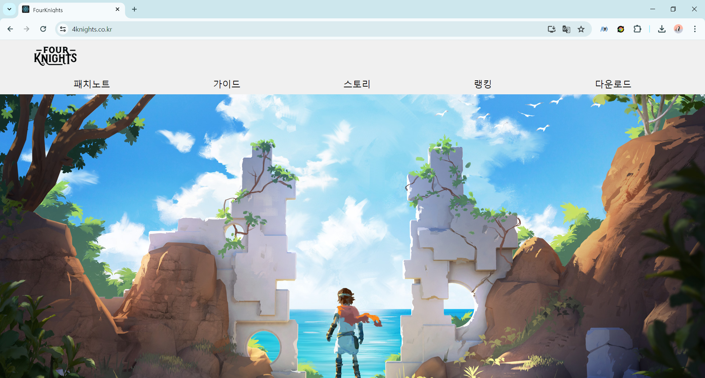
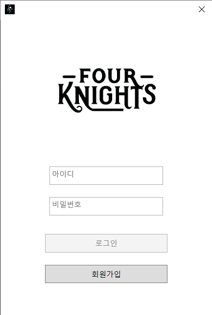
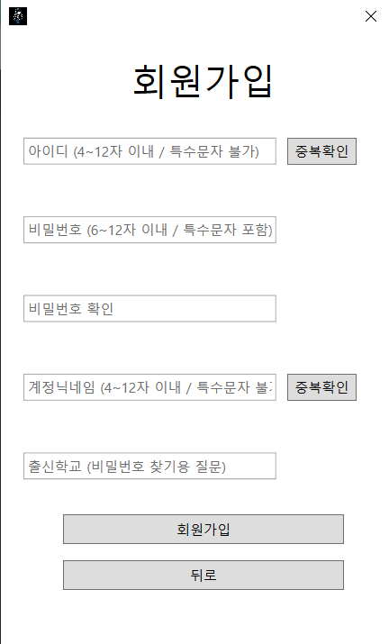
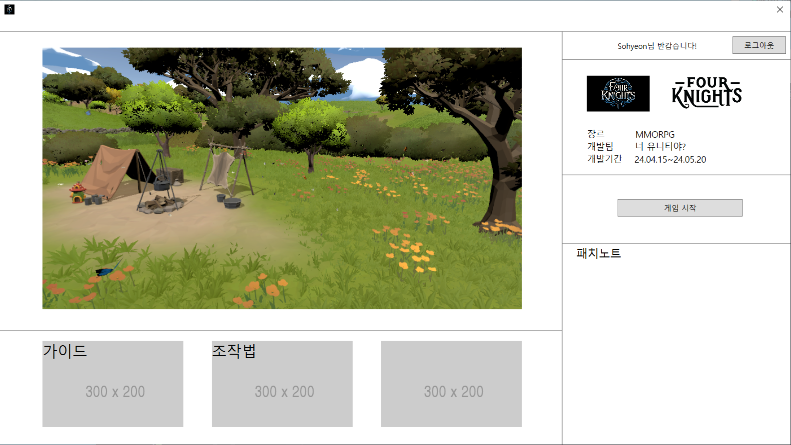

# Four Knights
👉 [GAME DOWNLOAD](https://www.4knights.co.kr/)</br>
👉 [GAME BUILD](https://drive.google.com/file/d/1qq7B22QTlkQIdM7Nag6u3Uq9VSMu39rh/view)</br> 
👉 [SOURCE CODE/ASSETS](https://drive.google.com/file/d/1jZvaquzq2abatI_Ial-WfpkSTaiy_QAx/view?usp=sharing/)</br>

## 목차
1. [개요](#Four-Knights)
2. [설계 문서](#설계-문서)
3. [개발 환경](#개발-환경)
4. [프로젝트 구조](#프로젝트-구조)
5. [팀원 소개](#팀원-소개)

## Four Knights
- 4가지의 직업 중 하나를 선택하여 사냥과 보스를 통해 재화를 얻고, 장비를 강화하며 성장하는 재미를 얻는다.
### 1.	사냥
- 솔로 플레이
- 핵 앤 슬래시
### 2.	레이드
- 멀티 플레이
- 1인 ~ 4인 파티 입장
### 3. 강화/승급
- 6개의 부위 강화 (투구, 갑옷, 장갑, 신발, 벨트, 무기)
- 10단계의 강화와 승급 시스템
### 4. 직업 4개
- 전사, 궁수, 마법사, 권사
### 5. 인게임
#### 1. 시작 화면 (서버 선택/캐릭터 선택)


#### 2. 마을 (시작하는 마을/잡화상점/장비강화)


#### 3. 파티 (생성/찾기/참여/입장)


#### 4. 보스 (골렘/드라이어드)


#### 5. 필드 (버려진 외곽/잃어버린 숲)


#### 6. 사망


#### 7. WEB


#### 8. WPF





## 설계 문서
- [컨벤션](https://nettle-donkey-951.notion.site/Convention-71dbb58adf8d46b09c421e2cde5d4e90?pvs=4)
- [기능/요구사항 명세서](https://nettle-donkey-951.notion.site/dc010b83176b43778419526911acd1e9?pvs=4)
- [ERD](https://nettle-donkey-951.notion.site/ERD-acbacd0e561b4f95a49cd70aa2b59b90?pvs=4)
- [API](https://nettle-donkey-951.notion.site/API-b7975c3500b1483a8fca51dbefbd8315?pvs=4)


## 개발 환경

#### Front-end
<br/>


-515151?style=for-the-badge)<br/>


<br/>

#### Back-end

<br/>


<br/>

<br/>

<br/>

#### Database

<br/>

#### WPF
<br/>
<br/>

#### Web
<br/>
<br/>

-515151?style=for-the-badge)<br/>

#### Infra
<br/>
<br/>
<br/>
<br/>
<br/>

#### Management Tool
<br/>
<br/>
<br/>
<br/>
<br/>

#### UCC
<br/>

## 프로젝트 구조
### [Front-end]
#### Unity
```
└─B208
    ├── Assets
    │   ├── 01.Scenes
    │   ├── 02.Scripts
    │   ├── 03.Prefabs
    │   ├── 04.Audio
    │   ├── 05.Font
    │   ├── 06.Sprites
    │   ├── 07.Animation
    │   ├── ExternalAssets
    │   ├── Materials
    │   ├── Photon
    │   ├── Plugins
    │   ├── Polygon Arsenal
    │   ├── Resources
    │   ├── Samples
    │   ├── Settings
    │   └── TextMesh Pro  
    ├── Library
    ├── Logs
    ├── Packages
    ├── ProjectSettings
    └── UserSettings
```

#### Web
```
└─fourknightsite
    ├─node_modules
    ├─src
    │   ├─pages
    │   └─sources
    └─public
```

#### WPF
```
└─WPFApp
    ├─Models 
    ├─Services
    ├─ViewModels
    │   └─Bases
    └─Views
```

### [Back-end]
```
└─knight
    ├─.gradle  
    ├─.idea
    ├─build
    ├─gradle
    └─src
        ├─main
        │  ├─java
        │  │  └─b208
        │  │      └─knight
        │  │          ├─api
        │  │          │  ├─controller
        │  │          │  ├─dto
        │  │          │  │  ├─request
        │  │          │  │  └─response
        │  │          │  └─service
        │  │          ├─common
        │  │          │  ├─config
        │  │          │  ├─exception
        │  │          │  └─model
        │  │          │      └─response
        │  │          └─db
        │  │              ├─entity
        │  │              ├─join
        │  │              └─repository
        │  └─resources
        │      ├─static
        │      ├─templates
        │      └─application.properties
        └─test
            └─java
                └─b208
                    └─knight
```


## 팀원 
### 소개


### 역할
#### 전소현 (팀장)
```
- Unity 개발
    - 맵 연결 및 이동
    - 환경 설정의 서버 선택창/캐릭터 선택창/마을로 돌아가기
    - 마을의 멀티 플레이
    - 필드의 솔로 플레이
    - 보스 파티 구현 (생성하기/찾기/참여하기/입장하기)
    - 채팅 기능 (RPC)
- Photon (Pun2)
    - 포톤 서버와 연결
    - 각 맵마다 방을 생성하여 캐릭터 스폰
    - 마을 20인/필드 1인/보스 4인의 방 생성
    - 로비(파티 찾기)에서 조건에 맞는 방(파티) 조회 및 참여
```
#### 송동호 (팀원)
```
- Unity 개발
    - 보스 몬스터 행동 패턴 및 플레이어 추적 알고리즘 구현
        - 골렘 (오브젝트 생성, 넉백, 낙사)
        - 드라이어드 (낮과 밤 요소, 덩굴과 식물 패턴, 투사체, 전멸 패턴, 시네마신)
    - 보스 몬스터 동기화 작업 수행 (RPC)
    - 마을 씬 및 보스 씬 최적화 작업 수행
```
#### 정원종 (팀원)
```
- Unity 개발
    - 캐릭터 기본 움직임 구현(이동 로직, 애니메이션, 사운드, Input)
    - 카메라 구현(캐릭터, 시작화면)
    - 게임 내 UI 제작(환경설정, 마을UI(상점, 레이드, 장비 등) , 플레이어UI 등)
    - 환경 설정 제작(플레이타임, 닉네임, 레벨, 해상도, 사운드, 민감도 조절 등)
- UCC
```
#### 이준혁 (팀원)
```
- 웹 FrontEnd 개발
    - 프론트엔드 디자인 및 컨텐츠 제작
    - Axios를 이용한 랭킹 데이터 처리
    - 스프레드 시트 API를 이용한 패치 노트 웹서버화

- WPF 개발
    - WPF 디자인
    - 회원가입 및 로그인 API 통신 (정규식을 통한 검증)
    - 유니티 버전 체크를 통한 업데이트 구현
    - 런처 접속 제한 구현 및 유니티에 정보 전달
    - 유니티 강제 종료 시, 백엔드에 전달할 데이터 보관 후 전송 처리

- Unity 개발
    - 유니티 전반의 모든 통신 API 관리
    - 채널 인원 트래킹 처리 및 캐릭터 생성 구현
    - 체력 관련 시스템 구현 (물약, 쉴드, 체력바 등)
    - 스텟 관련 시스템 구현 (강화, 승급 등)
    - 플레이어 UI 초반부 및 미니맵 작업
    - 플레이어의 공격 및 피격 처리 공동 작업
- QA
- 최종 발표
```
#### 백현우 (팀원)
```
- Unity 개발
    - 일반 몬스터 행동 패턴 구현
    - 일반 몬스터 리젠
    - 인벤토리
    - 상점
- Infra
    - EC2서버 설정
    - CI/CD구축 (GitLab->Jenkins->DockerImage->EC2)
    - Nginx (리버스 프록시)
- 중간 발표
```
#### 엄예진 (팀원)
```
- Back-end
    - API 설계 및 구현
- Database
    - 모델링 및 DB 설계
- Management
    - 협업툴 및 문서 관리
```
